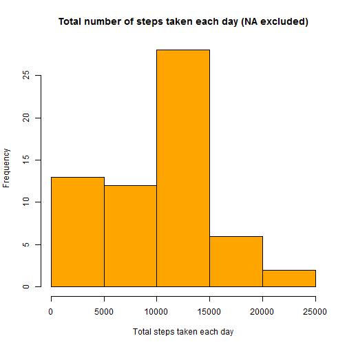
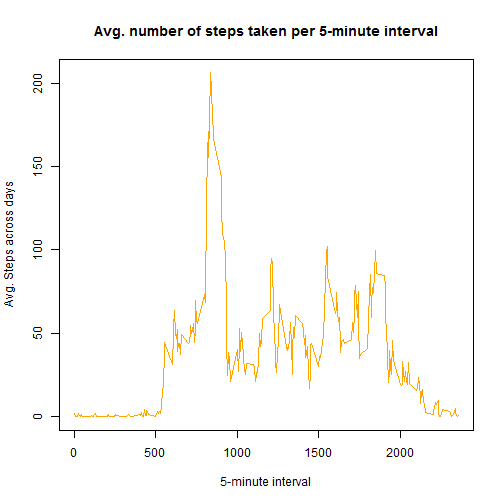
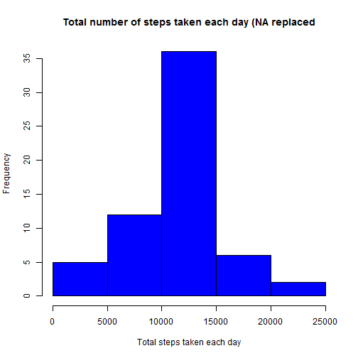
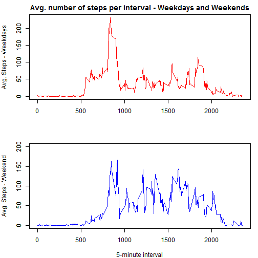

# Reproducible Research - Peer Assessment 1

Assumption: Working directory is set to where data file is stored.

```r
setwd("~/Coursera/DataScience/5_Reproducible_Research/courseproject1/repdata_data_activity")
```

## Loading and preprocessing the data

1. Load the data


```r
        # Select the file as it is stored in the working directory
        file <- "activity.csv"
        # Read in the file and store it variable dat
        dat <- read.table(file, header = T, sep = ",", stringsAsFactors = F)
```
2. Process/transform the data (if necessary) into a format suitable for your analysis

```r
        # Changing the date column to date format
        dat$date <- as.Date(dat$date)
```


## What is mean total number of steps taken per day?

For this part of the assignment, you can ignore the missing values in the dataset.

1. Calculate the total number of steps taken per day


```r
        # Load library
        library(plyr)
        # Sum steps per date and ignore NA values and store it in a data frame
        sum_per_day <- ddply(dat, .(date), summarise, total_steps=sum(steps,na.rm = T))
        # Print the result
        sum_per_day
```

```
##          date total_steps
## 1  2012-10-01           0
## 2  2012-10-02         126
## 3  2012-10-03       11352
## 4  2012-10-04       12116
## 5  2012-10-05       13294
## 6  2012-10-06       15420
## 7  2012-10-07       11015
## 8  2012-10-08           0
## 9  2012-10-09       12811
## 10 2012-10-10        9900
## 11 2012-10-11       10304
## 12 2012-10-12       17382
## 13 2012-10-13       12426
## 14 2012-10-14       15098
## 15 2012-10-15       10139
## 16 2012-10-16       15084
## 17 2012-10-17       13452
## 18 2012-10-18       10056
## 19 2012-10-19       11829
## 20 2012-10-20       10395
## 21 2012-10-21        8821
## 22 2012-10-22       13460
## 23 2012-10-23        8918
## 24 2012-10-24        8355
## 25 2012-10-25        2492
## 26 2012-10-26        6778
## 27 2012-10-27       10119
## 28 2012-10-28       11458
## 29 2012-10-29        5018
## 30 2012-10-30        9819
## 31 2012-10-31       15414
## 32 2012-11-01           0
## 33 2012-11-02       10600
## 34 2012-11-03       10571
## 35 2012-11-04           0
## 36 2012-11-05       10439
## 37 2012-11-06        8334
## 38 2012-11-07       12883
## 39 2012-11-08        3219
## 40 2012-11-09           0
## 41 2012-11-10           0
## 42 2012-11-11       12608
## 43 2012-11-12       10765
## 44 2012-11-13        7336
## 45 2012-11-14           0
## 46 2012-11-15          41
## 47 2012-11-16        5441
## 48 2012-11-17       14339
## 49 2012-11-18       15110
## 50 2012-11-19        8841
## 51 2012-11-20        4472
## 52 2012-11-21       12787
## 53 2012-11-22       20427
## 54 2012-11-23       21194
## 55 2012-11-24       14478
## 56 2012-11-25       11834
## 57 2012-11-26       11162
## 58 2012-11-27       13646
## 59 2012-11-28       10183
## 60 2012-11-29        7047
## 61 2012-11-30           0
```

2. Make a histogram of the total number of steps taken each day

```r
        # Histogram of the total number of steps taken each day
        hist(sum_per_day$total_steps, 
             xlab = "Total steps taken each day", 
             main = "Total number of steps taken each day (NA excluded)", col = "orange")
```

 

3. Calculate and report the mean and median of the total number of steps taken per day

```r
        # Mean of the total number of steps taken per day
        mean_total_steps_per_day <- mean(sum_per_day$total_steps)
        # Median of the total number of steps taken per day
        median_total_steps_per_day <- median(sum_per_day$total_steps)
        # Print the result
        c(mean = mean_total_steps_per_day, median = median_total_steps_per_day)
```

```
##     mean   median 
##  9354.23 10395.00
```


## What is the average daily activity pattern?

1. Make a time series plot of the 5-minute interval (x-axis) and the average number of steps taken, averaged across all days (y-axis)

```r
        # Mean of steps over all days per interval (NA removed)
        activity_pattern <- ddply(dat, .(interval), summarise, mean_of_steps=mean(steps,na.rm = T))
        
        # Average number of steps taken across all days per 5-minute interval
        plot(x=activity_pattern$interval, y=activity_pattern$mean_of_steps, type = "l", 
             main = "Avg. number of steps taken per 5-minute interval",
             xlab = "5-minute interval",
             ylab = "Avg. Steps across days",
             col = "orange")
```

 

2. Which 5-minute interval, on average across all the days in the dataset, contains the maximum number of steps?

```r
        # Maximum number of steps in an interval
        max(activity_pattern$mean_of_steps)
```

```
## [1] 206.1698
```


## Imputing missing values

Note that there are a number of days/intervals where there are missing values (coded as NA). The presence of missing days may introduce bias into some calculations or summaries of the data.

1. Calculate and report the total number of missing values in the dataset (i.e. the total number of rows with NAs)

```r
        # Subset data frame of the main data frame dat which has NA values
        dat_na <- dat[is.na(dat),]
        # The row count of this subsetted data set gives the total number of missing values
        total_NA_values <- nrow(dat_na)
        total_NA_values
```

```
## [1] 2304
```

2. Devise a strategy for filling in all of the missing values in the dataset. The strategy does not need to be sophisticated. For example, you could use the mean/median for that day, or the mean for that 5-minute interval, etc.

```r
        # Strategy for filling NA:
        # If a value for steps = NA then fill in the already calculated mean value for this interval (created in the data set activity_pattern)
```

3. Create a new dataset that is equal to the original dataset but with the missing data filled in.

```r
        # Making data set with NA and no NAs (dat_na already created in step 1)
        dat_no_na <- dat[complete.cases(dat),]
        # For data set with NAs adding a temporary column to the data set dat which gives the mean of the steps for each interval
        dat_na_transf <- merge(dat_na, activity_pattern, by.x = "interval", by.y = "interval")
        # For data set with NAs replace the NAs with the new column; then delete the temporarily added column
        dat_na_transf$steps <- dat_na_transf$mean_of_steps
        dat_na_transf <- dat_na_transf[,c(1:3)]
        # Now rbind the data set without NAs and the modified data set together --> there should not be any NA values left
        # The new data set is called: dat_na_replaced
        dat_na_replaced <- rbind(dat_no_na, dat_na_transf)
```

4. Make a histogram of the total number of steps taken each day and Calculate and report the mean and median total number of steps taken per day. 

```r
        # Sum steps per date and store it in a data frame (no NAs)
        sum_per_day_new <- ddply(dat_na_replaced, .(date), summarise, total_steps=sum(steps))        
                
        # Histogram of the total number of steps taken each day
        hist(sum_per_day_new$total_steps, 
             xlab = "Total steps taken each day", 
             main = "Total number of steps taken each day (NA replaced", col = "blue")
```

 

```r
        # Mean of the total number of steps taken per day
        mean_total_steps_per_day_new <- mean(sum_per_day_new$total_steps)
        # Median of the total number of steps taken per day
        median_total_steps_per_day_new <- median(sum_per_day_new$total_steps)
        # Print the result
        c(mean_new = mean_total_steps_per_day_new, median_new = median_total_steps_per_day_new)
```

```
##   mean_new median_new 
##   10766.19   10766.19
```
Do these values differ from the estimates from the first part of the assignment? What is the impact of imputing missing data on the estimates of the total daily number of steps?

```r
        # Putting results together in one data frame
        result1 <- c(mean = mean_total_steps_per_day, median = median_total_steps_per_day)
        result2 <- c(mean_new = mean_total_steps_per_day_new, median_new = median_total_steps_per_day_new)
        result12 <- rbind(result_w_exluded_NA = result1,result_w_imputed_NA=result2)
        # Print the data frame
        result12
```

```
##                         mean   median
## result_w_exluded_NA  9354.23 10395.00
## result_w_imputed_NA 10766.19 10766.19
```
Yes, the two results differ from each other the new mean and median are almost the equal to each other and are both higher the previous result.
The histogram shows a shift to a higher frequency in the mid-range of total steps taken each day.


## Are there differences in activity patterns between weekdays and weekends?

For this part the weekdays() function may be of some help here. Use the dataset with the filled-in missing values for this part.

1. Create a new factor variable in the dataset with two levels - "weekday" and "weekend" indicating whether a given date is a weekday or weekend day.

```r
        # Based data set = dat_na_replaced
        # Set locale to english
        Sys.setlocale("LC_TIME", "English")
```

```
## [1] "English_United States.1252"
```

```r
        # Add the variable weekday_weekend to the data frame dat_na_replaced
        dat_na_replaced$weekday_weekend <- ifelse(weekdays(dat_na_replaced$date) %in% c("Saturday","Sunday"),"weekend","weekday")
        # Make it a factor variable
        dat_na_replaced$weekday_weekend <- as.factor(dat_na_replaced$weekday_weekend)
```

2. Make a panel plot containing a time series plot (i.e. type = "l") of the 5-minute interval (x-axis) and the average number of steps taken, averaged across all weekday days or weekend days (y-axis). See the README file in the GitHub repository to see an example of what this plot should look like using simulated data.

```r
        # Mean of steps over all days per interval (NA removed)
        activity_pattern_new <- ddply(dat_na_replaced, .(interval,weekday_weekend), summarise, mean_of_steps=mean(steps,na.rm = T))
        activity_pattern_new_weekday <- activity_pattern_new[activity_pattern_new$weekday_weekend == "weekday",]
        activity_pattern_new_weekend <- activity_pattern_new[activity_pattern_new$weekday_weekend == "weekend",]
        # Average number of steps taken across all days per 5-minute interval: splitted in weekdays and weekends
        par(mfrow = c(2, 1),mar = c(4, 4, 2, 1))
        plot(x=activity_pattern_new_weekday$interval, y=activity_pattern_new_weekday$mean_of_steps, type = "l", 
             main = "Avg. number of steps per interval - Weekdays and Weekends",
             xlab = "",
             ylab = "Avg. Steps - Weekdays",
             col = "red")             
        axis(2,at=c(0,50,100,150,200),labels=c(0,50,100,150,200))
        plot(x=activity_pattern_new_weekend$interval, y=activity_pattern_new_weekend$mean_of_steps, type = "l", 
             xlab = "5-minute interval",
             ylab = "Avg. Steps - Weekend",
             col = "blue",
             ylim = c(0,200))
        axis(2,at=c(0,50,100,150,200),labels=c(0,50,100,150,200))
```

 


